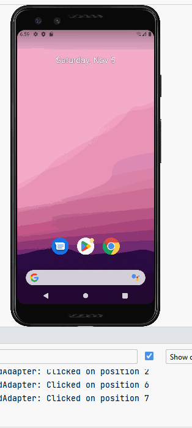
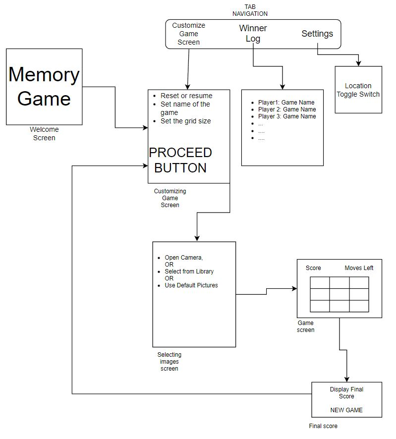

# Memory Game

## Table of Contents

1. [Overview](#Overview)
1. [Product Spec](#Product-Spec)
1. [Wireframes](#Wireframes)

## Overview

### Description

Memory Game app will be in the entertainment category. This game will first give the user a set amount of icons (n x m) and the user will be allowed to click on two images and will check if they are a match or not. This app will allow the user to customize the size of the photos displayed in the game (depending on the difficulty the user wants). It will have an option that will allow the user to customize and personalize the pictures they want in the game.

### App Evaluation

   - **Category:** Entertainment 
   - **Mobile:** Mobile is essential for the use of this app. This app is unique because, not only does it provide the user with a way to exercise their brain, they also get to personalize the game that they play. This will make the game a more personal experienced compared to other memory games. Also, great because it may be used offline, great for user underground or when there is no internet connection. 
   - **Story:** Memory card games test a person’s short-term memory and ability to remember patterns. They are a simple and fun way to engage the brain and activate areas related to pattern recognition and recall.
   - **Market:** Any person from any age group may utilize this app, this is why the size is customizeable. 
   - **Habit:** This app may be used any day, any time, and at any place. It can be used offline as well, so internet connection is never needed. 
   - **Scope:** To complete this app, it will be a bit challenging, but will be doable. Everything needed to build what is listed above is well defined.

## Product Spec

### 1. User Features (Required and Optional)

**Required Features**

- [X] * User can customize size of (n x m) items in game
- [ ] * User can use their own pictures from gallery in the game
- [ ] * User can reset the game 
- [ ] * User can see how many pairs they have gotten
- [ ] * User will receive congratulations message after successfully completing a set
- [ ] * User can design their own custom game and name it, will be saved for future use 

**Stretch Features**

* Utilize camera to create game in real time
* Keeps track of progress and displays the score on the day they played 
* Add Location feature and use an API to get the images of local monuments/scenery for the game

### 2. Screen Archetypes

- Welcome Screen
  - Screen will show game logo and animations & welcome user.
  
- Game Screen 
  - User can see the amount of successfully found pairs
  - User can see how many "moves" they have 

- Selecting Images Screen
    - User can select pictures from their gallery. Could let the users access the camera and take pictures OR select the default game.
- Customizing Game Screen
    - User can reset game or resume the current game
    - User can input the player name and select what icons they want. 
    - User can edit card size by clicking top right button
- Winner Log
    - Tracks the name and the score of players. 

- Final Score
    - Displays final score

### 3. Navigation

**Tab Navigation** (Tab to Screen)

* Customizing Game Screen
    - => Edit Size
    - => Edit Game Name 
    - => Create personal game
* Winner Log
* Settings

**Flow Navigation** (Screen to Screen)

- Welcome Screen
  - => Customizing Game Screen
  
- Customizing Game Screen
  - => Selecting images screen.

- Selecting images screen
  - => Game Screen

- Game Screen
  - => Final Score - after the game ends

- Winner Log
    - => None - just displays the past scores with the game names

- Settings
  - => None - but future version may let you toggle location in order to get the images of local scenery from the API and load it into the gallery db (room??)

 

  

## Wireframes

[Add picture of your hand sketched wireframes in this section]

